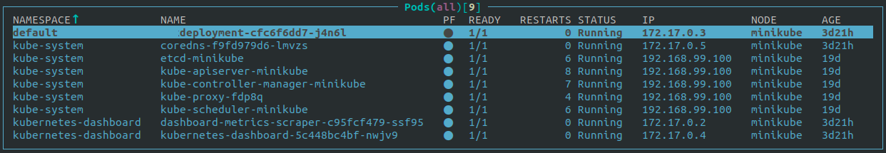

# 

## - Kubernetes Environments -

CT - [Container.Training](https://container.training)  

Kubelabs - [An Ultimate Kubernetes Hands-on Labs](https://collabnix.github.io/kubelabs/)  

Kubernetes Docs - [Getting startted for example all commands](https://kubernetes.io/docs/reference/generated/kubectl/kubectl-commands#-strong-getting-started-strong-)  

Play with Kubernetes(non install) - [The Play with Kubernetes classroom is a new site provided by Docker that helps you get hands-on experience using Kubernetes](https://labs.play-with-k8s.com)  

k3d - [Lightweight wrapper to run k3s (Rancher Lab’s minimal Kubernetes distribution) in docker](https://github.com/rancher/k3d)  

k3s - [The certified Kubernetes distribution built for IoT & Edge computing](https://github.com/k3s-io/k3s)  

MicroK8s - [Low-ops, minimal production Kubernetes, for devs, cloud, clusters, workstations, Edge and IoT](https://github.com/ubuntu/microk8s)  

Kind - [Kind is a tool for running local Kubernetes clusters using Docker container "nodes"](https://github.com/kubernetes-sigs/kind/)  

Minikube - [Minikube implements a local Kubernetes cluster on macOS, Linux, and Windows](https://github.com/kubernetes/minikube)  

Minishift - [Minishift is a tool that helps you run OpenShift locally by running a single-node OpenShift cluster inside a VM](https://github.com/minishift/minishift)  

Kubeadm - [The purpose of this repo is to aggregate issues filed against the kubeadm component](https://github.com/kubernetes/kubeadm)  

Kubespray - [Deploy a Production Ready Kubernetes Cluster](https://github.com/kubernetes-sigs/kubespray)  

kOps - [The easiest way to get a production grade Kubernetes cluster up and running](https://github.com/kubernetes/kops/)  

Rancher RKE - [Rancher Kubernetes Engine, an extremely simple, lightning fast Kubernetes installer that works everywhere](https://github.com/rancher/rke)  
